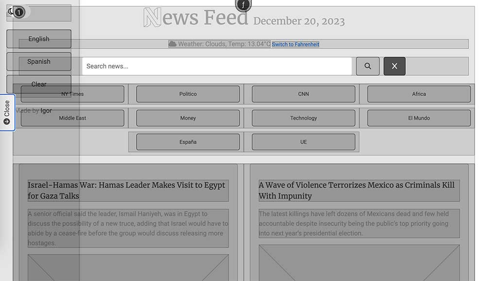

# News Feed Web Application 

This README provides detailed information about the News Feed web application. The application offers a dynamic experience to explore various RSS news feeds, with features like a dark/light mode switch, language filters, weather updates, and social media sharing. [Live page](https://igordinuzzi.github.io/newsfeed/)


## Table of Contents
- [Introduction](#introduction)
- [Features](#features)
- [User Stories](#user-stories)
- [Design Elements](#design-elements)
- [User Flow](#user-flow)
- [Task Flow](#task-flow)
- [Code Snippets](#code-snippets)
- [Usability Testing](#usability-testing)
- [Learning Outcomes (From a Student's Perspective)](#learning-outcomes-from-a-students-perspective)
- [Installation](#installation)
- [Usage](#usage)
- [Deployment in GitHub Pages](#deployment-in-github-pages)
- [Contributing](#contributing)
- [License](#license)
- [Contact](#contact)

## Introduction
The News Feed app is a web-based platform that aggregates news from different sources via RSS feeds. It's built using HTML, CSS, and JavaScript, with a focus on providing an interactive and user-friendly interface for reading news.


## Features
- **Dynamic News Tabs**: Tabs generated dynamically based on available RSS feeds.

- **Weather Updates**: Real-time weather information based on user location.

- **Dark/Light Mode**: Toggle between dark and light modes for comfortable reading.
 
- **Language Filters**: News can be filtered based on English or Spanish sources.


- **Search Functionality**: Search through news items using keywords.

- **Social Media Sharing**: Share news items on Twitter.


## User Stories
1. **News Enthusiast**: Wants a central hub for reading various news feeds.
2. **Language Learner**: Prefers reading news in different languages for practice.
3. **Social Media User**: Shares interesting news articles on social media platforms.

## Design Elements




- **Responsive Layout**: Ensures a seamless experience across different devices.
- **Color Scheme**: Contrasting colors for dark and light modes to enhance readability.
- **Interactive Components**: Dynamic tabs, search bar, and social media icons for engagement.

## User Flow
1. User opens the web application.
2. User toggles between dark and light modes for preferred reading.
3. User selects news tabs to read different RSS feeds.
4. User uses language filters to change news language.
5. User shares articles on social media.

## Task Flow
1. **Changing Modes**: Click the toggle button to switch between dark and light modes.
2. **Selecting News Feeds**: Click on the tabs to view different news sources.
3. **Filtering by Language**: Select the language buttons to filter news.

## Code Snippets
- **Toggle Dark/Light Mode**:
  ```javascript
  document.getElementById('toggleMode').addEventListener('change', function() {
    if (this.checked) {
        document.body.classList.add('dark-mode'); // Add dark mode class
    } else {
        document.body.classList.remove('dark-mode'); // Remove dark mode class
    }
  });

  ```
- **Fetch RSS Feeds**:
  ```javascript
  function displayNewsItems(items, containerId) {
    const newsFeedContainer = document.getElementById(containerId);
    newsFeedContainer.innerHTML = ''; // Clear previous content

    items.forEach(item => {
        const col = document.createElement('div');
        col.className = 'col-12 col-md-6 mb-4';

        const newsItem = document.createElement('div');
        newsItem.className = 'news-item';

        // Title
        const title = document.createElement('div');
        title.className = 'news-title';
        title.innerHTML = `<a href="${item.link}" target="_blank">${item.title}</a>`;
        newsItem.appendChild(title);

        // Description
        const description = document.createElement('div');
        description.className = 'news-description';
        description.innerHTML = item.description;
        newsItem.appendChild(description);

        // For the image
        if(item.enclosure && item.enclosure.link) {
        const image = document.createElement('img');
        image.src = item.enclosure.link;
        image.className = 'img-fluid';
        image.setAttribute('aria-label', 'News Image'); // Added aria-label
        newsItem.appendChild(image);
        }

        // Social Share Button
        const shareButton = document.createElement('button');
        shareButton.className = 'share-button';
        shareButton.innerHTML = '<i class="fa-brands fa-twitter"></i> Share';
        shareButton.setAttribute('aria-label', 'Share on Twitter'); // Added aria-label
        shareButton.onclick = () => shareNews(item.link);
        newsItem.appendChild(shareButton);

        col.appendChild(newsItem);
        newsFeedContainer.appendChild(col);
  ```

## Usability Testing
Conducted with five users to test navigation, readability, and overall user experience. Feedback included requests for more intuitive navigation and adding bookmarking features for news articles.

## Learning Outcomes (From a Student's Perspective)
Developing the News Feed app enhanced my skills in web development, particularly in JavaScript for fetching and displaying RSS feeds dynamically. I learned about user interface design, creating responsive layouts, and implementing user-centric features like dark/light mode switching and language filters. The project also improved my understanding of APIs and their integration into web applications.

## Installation
1. Clone the repository to your local machine.
   ```sh
   git clone https://github.com/igordinuzzi/news-feed.git
   ```
2. Open the `index.html` file in a web browser to run the application.

## Usage
- **Viewing News**: Click on the tabs to view news from different sources.
- **Switching Modes**: Use the toggle in the sidebar to switch between dark and light modes.
- **Filtering News**: Use the language buttons in the sidebar to filter news by language.

## Deployment in GitHub Pages
The application can be deployed on GitHub Pages:
1. Push the project to a GitHub repository.
2. In the repository settings, navigate to the Pages section.
3. Select the branch to deploy and save.
4. Access the deployed site via the provided URL.

## Contributing
Contributions are what make the open-source community an amazing place to learn, inspire, and create. Any contributions you make are greatly appreciated.

## License
Distributed under the MIT License. See `LICENSE` for more information.

## Contact
- Igor Dinuzzi - [@igordinuzzi](https://github.com/igordinuzzi)
- Project Link: [https://github.com/igordinuzzi/news-feed](https://github.com/igordinuzzi/news-feed)

